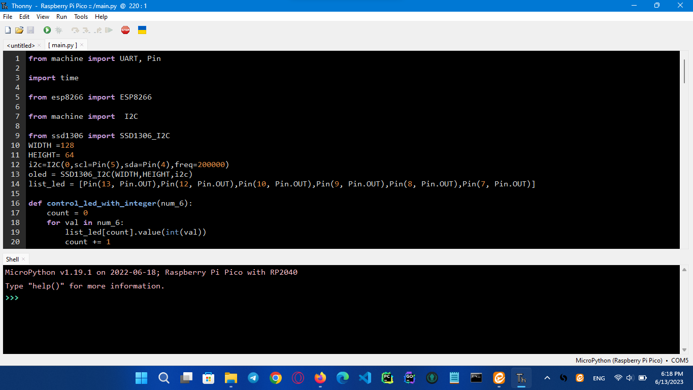

# Important note :
Note that as it will be said in the target section, our goal is to show the micro-contoller-pins received commands from the server and the LEDs turn on and off with the desired order that we tell the server on the micro board, and the text that In the field on the server, we set it to show on the screen and also change the text, so if we use a health sensor module (such as a blood pressure monitor) instead of LEDs and a screen, it can be controlled and the data Collected it because we have shown the ability to control bases through the server in this project.

# Programmed with:  MicroPython language

# micro-controller : Raspberry pi pico 
# datasheet : 

# Tools:

<ul>
  <li>esp8266      ->  WIFI </li>
  <li>ssd1306 oled ->  monitor</li>
  <li>ttp224       ->  keyboard</li>
  <li>LED</li>
  <li>RES 1k</li>
  <li>board</li>
</ul>

# ide : Thonny

# Target:
The purpose of this project is to run the main code on the Raspberry Pi Pico and connect it to other hardware such as the esp8266 Wi-Fi module and the ssd1306 display module and several LEDs to show how it can be commanded by connecting to a took Therefore, in this project, the goal is to show the ability to control the microcontroller through Wi-Fi and data transmission

